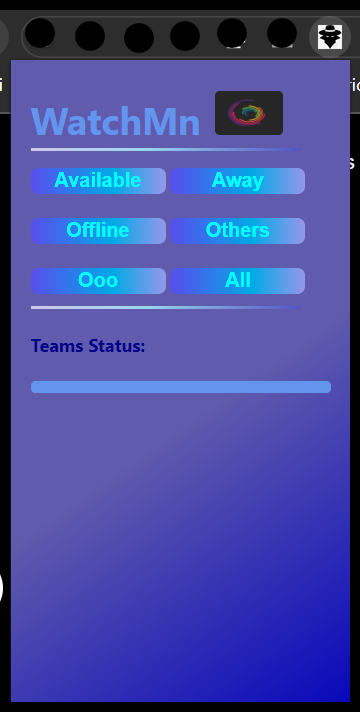

## Hello peeps👋!

 WatchMn (isnpired from hindi word <i>chowkidar</i>) is chrome extension to capture the status of Teams Chat's of friends without moving to orignal tab. 
The user just has to keep the Teams app open in the browser and forget it. This extension grabs the status of the chats in the background and displays 
it whenever / wherever requred in the tab in a pretiffied manner.

## Screenshots:-

 &nbsp; &nbsp; &nbsp;

 

## How to use:-
<li>Fork the app</li>
<li>Download the source code using git</li>
<li>Go to chrome://extensions/ & switch on developer mode</li>
<li>Click on Load Unpacked button and select the folder containing downloaded source code, the plugin gets added</li>
<li>Open Microsoft Teams and forget it</li>
<li>Now you can freely switch to any tab/window & use the extension</li>

## Points to be noted:-
<li>Microsoft Teams should be open in any window/tab of the Chrome browser.</li>
  Please ignore the wrong spellings🙏,some of them are intended</i>
